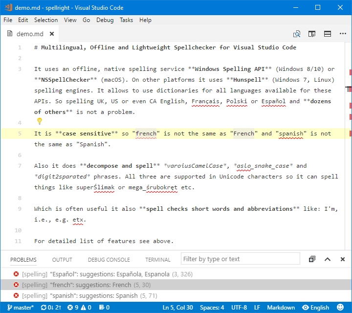
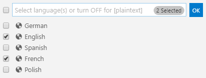

# Spell Right

Spell Checker for Visual Studio Code.

## Features

* Spells **plain text**/**markdown**/**LaTeX** documents, strings/comments on most **source code** documents and text/CDATA/comments nodes on **XML**/**HTML** class documents.
* Uses system native spell checking service whenever possible: Windows Language Services (windows 8/10) or Hunspell (windows XP/vista/7, macOS, Linux).
* Whenever available (Windows 8/10, macOS) uses dictionaries installed with system spell checking engines.
* Uses differential editing information - extension tries to minimize area spelled during editing (following document changes) only to lines touched by edits.
* Unlike many other spell checkers it tries to spell short words and abbreviations (etc., i.e., ...)
* Unobtrusive **GUI**/**command palette** interface for switching spelling dictionary (language) and turning spelling ON/OFF for particular document type.

> Until VSCode's team decides to support some sort of core spelling capabilities, like [node-spellchecker](https://github.com/atom/node-spellchecker), from inside of the VSCode's distribution, **this extension is compatible only with 64-bit Windows platform**. For details see (and up-vote maybe) discussion about VSCode's feature request [#20266](https://github.com/Microsoft/vscode/issues/20266).

## Screenshot



[More Screenshots](SCREENSHOTS.md)

## Installation

Search for *Spell Right* from the extension installer within VSCode or execute below line in the **command palette** (**F1**/**Ctrl+Shift+P**):
```
ext install spellright
```

## Usage

### Correcting Spelling Errors

Use **F8**/**Shift-F8** to jump to next/previous spelling error. Press **Ctrl+.** or click *Lightbulb* to see context menu with suggestions.

### Changing Language and Turning OFF

Extension has a handy list interface for switching spelling dictionary (language) or turning spelling OFF for currently open document type:



It can be reached by clicking on indicator field in status bar:


Alternatively same result can be achieved selecting command `SpellRight: Select Dictionary (Language)` or `SpellRight: Turn OFF for Current Document Type` from the **command palette**.

## Commands

`SpellRight: Create/Update Workspace Settings`

Creates or updates workspace settings file `spellright.json`.

`SpellRight: Select Dictionary (Language)`

Pops dictionary selection GUI. The list also allows to turn spelling OFF for currently open document type. Can also be reached by clicking indicator field in status bar.

`SpellRight: Turn OFF for Current Document Type`

Turn spelling OFF for currently open document type.

## Settings

This extension contributes the following settings (with default values):

`spellright.language: en_US`

Default language (dictionary/culture name) used for spelling. Typically in a LANGUAGE_CULTURE format (e.g. "en_US", "fr_CA", "pl_PL" etc.)

`spellright.statusBarIndicator: true`

Enable/disable language & status indicator switch in status bar.

`spellright.suggestionsInHints: true`

Enable/disable including suggested corrections in hints. Disabling suggestions significantly speeds checking up. May be useful in case of large, often switched or saved documents.

`spellright.documentTypes: [ "plaintext", "markdown", "latex" ]`

Document types for which spelling will be turned ON by default.

`spellright.ignoreWords: []`

Words ignored by in spelling. Usually contains words which are considered misspelled by the main spelling engine but should be ignored/treated as spelled correctly by the extension.

`spellright.ignoreRegExps: []`

Regular expressions ignored in spelling. Allows to ignore generalized misspelled expressions.

## Dependences

This extension depends on [node-spellchecker](https://github.com/atom/node-spellchecker) native (binary) module. Module is installed along with the extension but only with binary bindings compatible with 64-bit Windows platform.

## Known Issues

* VSCode is missing event that would tell extension about cursor jumps in the document. Recently entered word which has not been ended with a white space or punctuation character will be spelled not on cursor jump but on a subsequent edit somewhere else in the document (this is probably more of a VSCode's issue).
* Hint box associated with "Bulb" Code Action has an ugly habit of wrapping text at certain width not at white/punctuation character thus suggestions got cut in weird places (this is probably more of a VSCode's issue).
* Status bar indicator is not always in the same place - other extensions that add items to status bar "compete" for the place and it jumps from the last to one before last position in some cases (as all the above this is probably more of a VSCode's issue).

This extension can still be considered a Work In Progress so please report all the annoyances that you see on the [Issues](https://github.com/bartosz-antosik/vscode-spellright/issues) page.

## Acknowledgments

Part of extension's code is loosely based on code found in *Spell Checker* extension ([vscode-spellchecker](https://github.com/swyphcosmo/vscode-spellchecker)) by Michael Vernier. This extension has in turn, if I understand things correctly, evolved from *Spelling and Grammar Checker* extension ([vscode-spell-check](https://github.com/Microsoft/vscode-spell-check)) by Sean McBreen.

## Release Notes

[Changelog](CHANGELOG.md)
