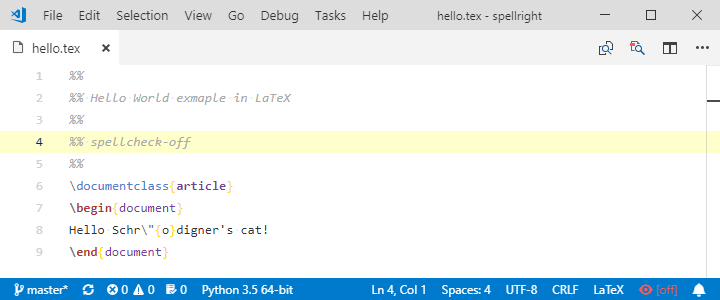
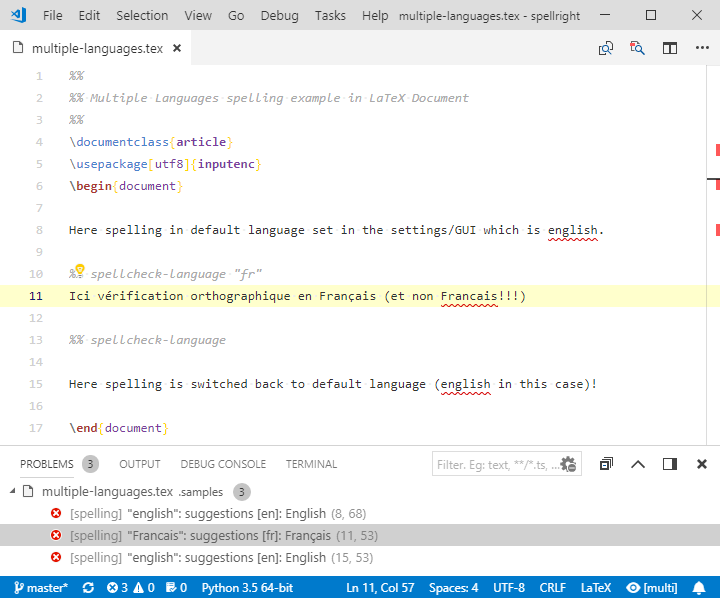

# Spell Right

Spell Checker for Visual Studio Code.

## Features

* Spells **plain text**/**markdown**/**LaTeX** documents, *strings*/*comments* parts of most **source code** (C++, Python, JavaScript, Batch etc.) documents and *text*/*comment* nodes on **XML**/**HTML** class documents.
* Supports **every language** that can be used with either of the below mentioned native spelling engines (e.g. all languages available in Microsoft Office etc.)
* Spelling **multiple languages in one document** using InDoc commands to switch between languages.
* **Case sensitive** which means that it will distinguish between *english* and *English*, *french* and *French* etc.
* Spells **short words** and **abbreviations** (etc., I'm, i.e., ...)
* Spells **CamelCase**, **snake_case** and **digit2inside** compound phrases respecting Unicode capital/small letters distinction (e.g.: *SuperŚlimak* -> *Super* *Ślimak*) and capital letter adhesion (e.g.: *HTMLTest* -> *HTML* *Test*).
* Unobtrusive **GUI**/**command** interface for switching spelling dictionary (language) and turning spelling ON/OFF for particular document class.
* **In document commands** (abbreviated *InDoc*) allow to switch spelling ON and OFF despite global settings and switching spelling language.
* Small memory & CPU usage footprint - uses **offline**, **OS native** spell checking service whenever possible: Windows Spell Checking API (windows 8/10) or Hunspell (windows 7, macOS, Linux).
* Extension uses **background processing** (on idle) and **differential edit notifications** to minimize area spelled during editing only to lines touched by changes.

## Note on Usability

This extension is currently limited to **64-bit Windows platform**, with the same Node.js version as the main distribution (VSCode Insiders Edition may not work). It is due to problems with distribution of native modules in current VSCode's distribution model. It could work on all platforms (including **macOS** and **Linux**) but VSCode team should include one module, used by this extension, in distribution builds. For details see (and up-vote maybe) discussion about VSCode's feature request [#20266](https://github.com/Microsoft/vscode/issues/20266).

## Screenshots

Spelling of **plain text**/**markdown**/**LaTeX** documents:


It can spell *strings*/*comments* parts of most **source code** (*C++*, *Python*, *JavaScript*, *Batch* and lots of others) and *text*/*comment* nodes on **XML**/**HTML** class documents:


## Installation

Search for *Spell Right* from the extension installer within VSCode or execute below line in the **command palette** (**F1**/**Ctrl+Shift+P**):
```
ext install spellright
```

### Note on Windows 7 Installation

Windows 7 does not have Spell Checking API so in this case extension uses then built in *Hunspell* spell checker. To use it a pair of Dictionary (\*.dic) and Affixes (\*.aff) files have to be downloaded from [here](https://github.com/titoBouzout/Dictionaries) (please remember to download RAW files) and placed in `Dictionaries` subfolder of VSCode's user global configuration directory, usually located at:

```
c:\Users\%USERNAME%\AppData\Roaming\Code\
```

`Dictionaries` subfolder does not exists there by default and has to be created manually. Dictionaries will be then listed in the language selection list and used for spelling documents. Because *Hunspell* engine is slower in serving suggestions to misspelled words it may be useful to set `spellright.suggestionsInHints` to false. It will speed spelling up and suggestions will still be available in context menu called upon action for the suggestion.

## Usage

### Correcting Spelling Errors

Use **F8**/**Shift-F8** to jump to next/previous spelling error. Press **Ctrl+.** or click *Lightbulb* to see context menu with suggestions.

### Changing Language and Turning OFF

Extension has a handy list interface for switching spelling dictionary (language) or turning spelling OFF for currently open document type:


It can be reached by clicking on indicator field in status bar:


Alternatively same result can be achieved selecting command `SpellRight: Select Dictionary (Language)` or `SpellRight: Turn OFF for Current Document Type` from the **command palette** (**F1**/**Ctrl+Shift+P**).

Status bar indicator also shows when spelling for particular document class has been turned OFF:


Or when it has been forced OFF by InDoc command (`spellcheck-off`) or rule in `.spellignore`:



### Multiple languages in one document

When there is multiple languages selected by InDoc command `spellcheck-language` placed within document:



And when at least one spelling language is missing dictionary:


## Commands

This extension contributes the following commands:

`SpellRight: Create/Update Workspace Settings`

Creates or updates workspace settings file `spellright.json`.

`SpellRight: Select Dictionary (Language)`

Pops dictionary selection list. Selecting language also turns spelling ON. The list also allows to turn spelling OFF for currently open document type. Can also be reached by clicking indicator field in status bar.

`SpellRight: Turn OFF for Current Document Type`

Turn spelling OFF for currently open document type.

## Settings

This extension contributes the following settings (with default values):

`spellright.language: en`

Default language (dictionary/country name) used for spelling. Typically in a LANGUAGE or LANGUAGE-COUNTRY format (e.g.: "en", "fr", "en-US", "en-GB", "fr-CA", "pl-PL" etc.)

`spellright.statusBarIndicator: true`

Enable/disable language & status indicator switch in status bar.

`spellright.suggestionsInHints: true`

Enable/disable including suggested corrections in hints. Disabling suggestions significantly speeds checking up. May be useful in case of large, often switched or saved documents.

`spellright.documentTypes: [ "plaintext", "markdown", "latex" ]`

Document types for which spelling will be turned ON by default.

`spellright.ignoreWords: []`

Words ignored in spelling. Usually contains words which are considered misspelled by the main spelling engine but should be ignored/consider as spelled correctly by the extension. Words on the list are compared case insensitive.

`spellright.ignoreRegExps: []`

Regular expressions ignored in spelling. Allows to ignore/consider as spelled correctly generalized expressions. Works after separating word using language parsers in the same place where spelling engine is consulted and ignoreWords checked. Regular expressions have to be in double quoted format. That is backslash has to be quoted as well e.g.: `"/(\\\\.?)(gif|png)/g"` to ignore file extensions like `".gif"` and `".png"`.

`spellright.ignoreFiles: [ "**/.gitignore", "**/.spellignore" ]`

Set of file patterns to globally, silently exclude files from being spelled. Files described with this setting will not be reported as forced OFF spelling (red indicator in status bar). Patterns defined as for [gitignore](https://git-scm.com/docs/gitignore).

## InDoc Commands

Beside global settings following commands can be embedded inside spelled parts of the document (e.g.: comments, strings etc.):

`spellcheck-language CODE` (alternative syntax: `spellcheck: language CODE`)

Forces **switching spelling language** for the following part of the document or until next `spellcheck-language CODE` command. `CODE` is language code according to used spellcheck background service, typically in a LANGUAGE or LANGUAGE-COUNTRY format (e.g.: "en", "fr", "en-US", "en-GB", "fr-CA", "pl-PL" etc.) If `CODE` is empty switches **back to default spelling language**.

Forces turning spelling **OFF** for the entire document despite global settings.

`spellcheck-off` (alternative syntax: `spellcheck: off`)

Forces turning spelling **OFF** for the entire document despite global settings.

`spellcheck-on` (alternative syntax: `spellcheck: on`)

Forces turning spelling **ON** for the entire document despite global settings. Has higher priority than turning spelling off with both *InDoc* `spellcheck-off` command and `.spellignore` patterns.

## Ignore file

`.spellignore` file located in workspace root directory can be used to disable spelling for documents described by [gitignore](https://git-scm.com/docs/gitignore) syntax file patterns.

## Known Issues

* VSCode is missing event that would tell extension about cursor jumps in the document. Recently entered word which has not been ended with a white space or punctuation character will be spelled not on cursor jump but on a subsequent edit somewhere else in the document (this is probably more of a VSCode's issue).
* Hint box associated with "Bulb" Code Action has an ugly habit of wrapping text at certain width not at white/punctuation character thus suggestions got cut in weird places (this is probably more of a VSCode's issue).
* Status bar indicator is not always in the same place - other extensions that add items to status bar "compete" for the place and it jumps from the last to one before last position in some cases (as all the above this is probably more of a VSCode's issue).

## Notice

This extension can be considered a Work In Progress. Please report all the errors and/or annoyances that you see on the [issues](https://github.com/bartosz-antosik/vscode-spellright/issues) page.

## Release Notes

[Changelog](CHANGELOG.md)
